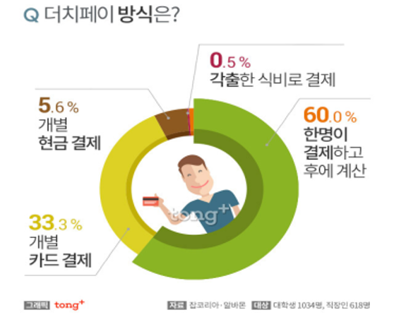
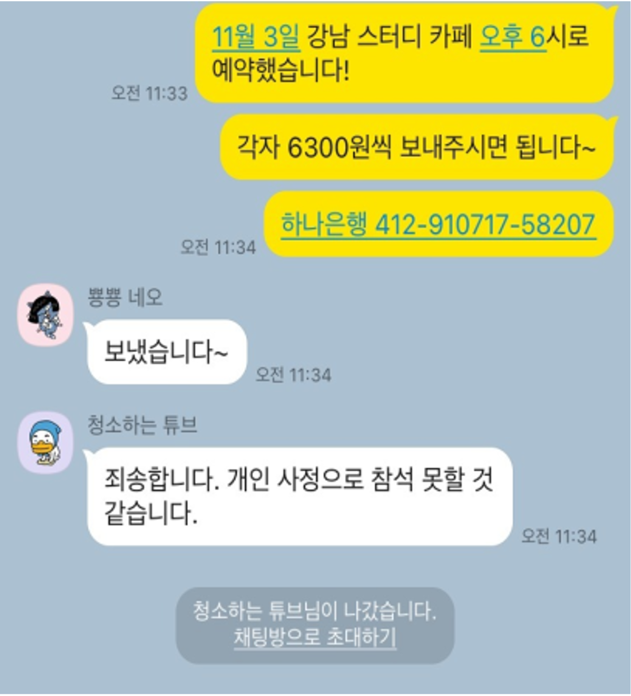
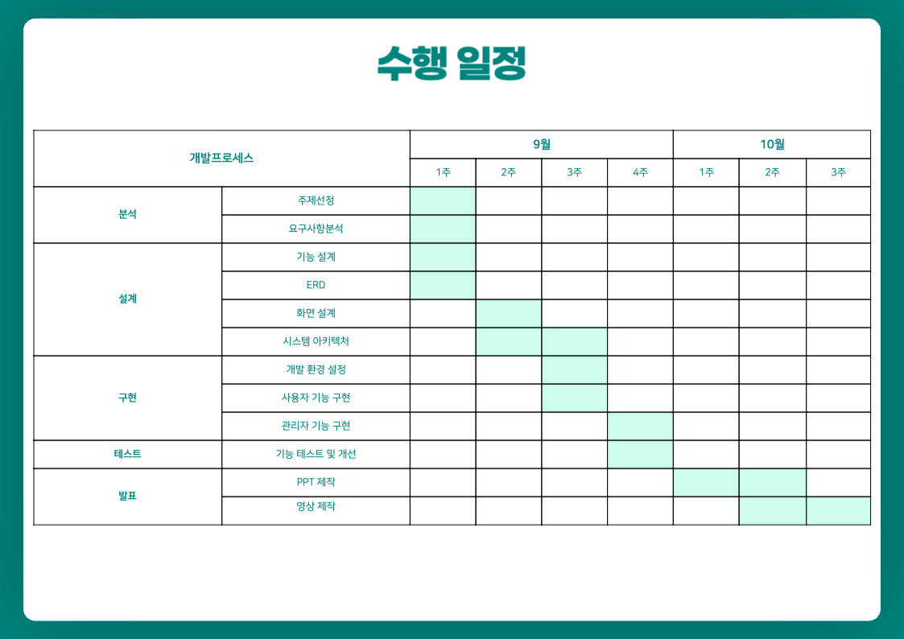
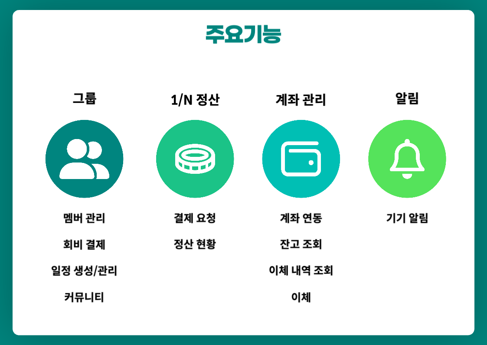
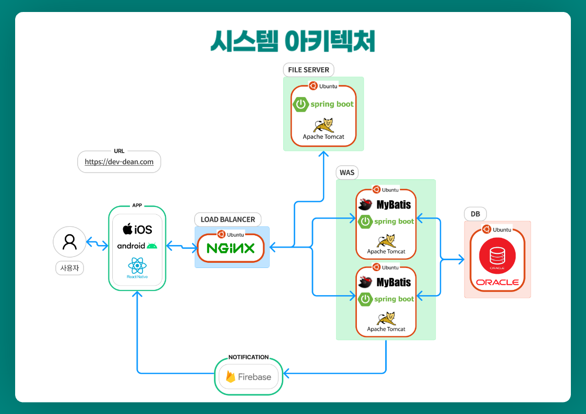
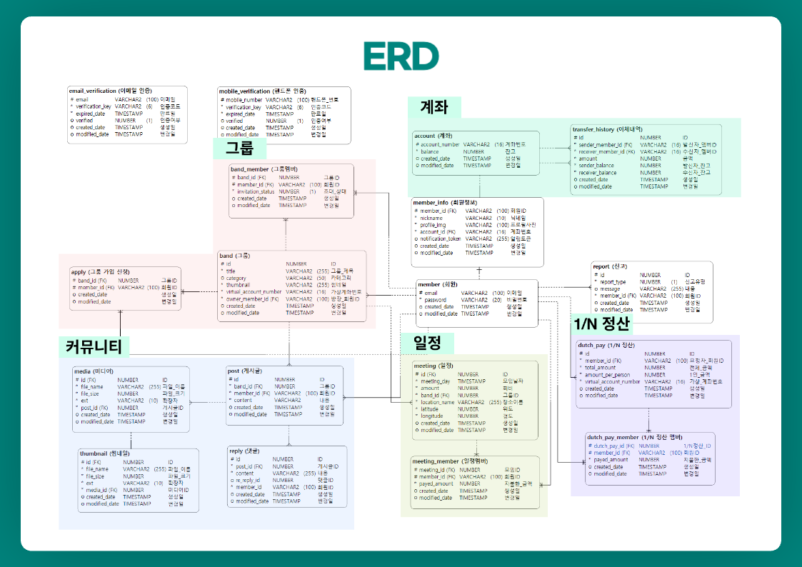

# 하나모여 - 1/N 정산, 모임, 회비 관리까지

## 프로젝트 개요

### 프로젝트 배경

모 기관에서 더치페이에 관한 조사를 진행한 결과 더치페이를 한다는 응답이 90.1%에 달하였고 대표자 한 명이 결제하고 후에 계산한다고 하는 응답이 전체의 절반 이상을 차지하는 것을 볼 수 있습니다.
또한 스터디, 모임과 같은 단체에서 일정을 잡거나 회비 관리를 기존의 메신저 서비스에서 하는 데 한계가 있다고 생각하여 다수에게 이체를 요청해야 하는 어려움과 모임의 일정, 회비 관리의 불편함을 해소하기 위한 서비스가 필요하다고 생각하여 하나모여 서비스를 개발하게 되었습니다.

### 프로젝트 목적

- 더치페이와 그룹 커뮤니티 기능뿐만 아니라 일정을 관리하고 회비를 결제할 수 있는 통합 서비스를 개발하여 사용자의 편의성 증대

## 프로젝트 발표 자료

### 발표 PPT

[발표자료](./readme자료/하나모여_강태근.pptx)

### 시연 동영상

<a href="https://youtu.be/NlqxPvKvgVI" target="_blank">시연 동영상</a>

### 수행 기간

2023.09.01 ~ 2023.10.20

### 주요 기능

### 사용기술

- 본인인증을 위해 CoolSms와 Java Mail Sender 사용
- 로그인 인증 방식으로 JWT 사용
- BCrypt를 사용한 비밀번호 암호화
- 사용자의 핸드폰에 알림을 보내기 위해 Firebase 사용
- 도메인 등록과 SSL 인증서 적용 (https://dev-dean.com)
- Nginx의 로드밸런싱 기능을 사용하여 트래픽 분산

### 개발환경
- OS : Max OS X 13.4.1, Ubuntu 20.04 LTS
- Framework: Spring Boot 2.7.14, React Native 0.72.1, MyBatis 3.5.6
- Web Server : Nginx 1.18.0
- WAS : Tomcat 9.0.78
- Language : Java 11, JavaScript, HTML, CSS,
- Tool : IntelliJ, Eclipse, VS Code, SQL Developer, Data Grip, Xcode
- DB : Oracle 19c

### 시스템 아키텍처

### ERD

<table>
  <tr>
    <th>항목</th>
    <th>내용</th>
    <th>&nbsp;</th>
  </tr>
  <tr>
    <td>이름</td>
    <td>강태근</td>
    <td></td>
  </tr>
  <tr>
    <td>연락처</td>
    <td>이메일</td>
    <td>deankang0918@gmail.com</td>
  </tr>
  <tr>
    <td>학력사항</td>
    <td>가톨릭대학교 컴퓨터정보공학부</td>
    <td>졸업(2016.03 ~ 2022.02)</td>
  </tr>
  <tr>
    <td rowspan="3">Skill Set</td>
    <td>Language & Tools</td>
    <td>Java, Python, JavaScript, Solidity, Rust, Spring Framework, JSP, MyBatis, Spring Data JPA, React.JS, React Native</td>
  </tr>
  <tr>
    <td>Database</td>
    <td>Oracle, MySQL</td>
  </tr>
  <tr>
  <td>Etc</td>
  <td>Nginx, Docker, Git</td>
  </tr>
  <tr>
    <td>경력</td>
    <td>컴투스 홀딩스(2022.07.04 ~ 2022.09.23)</td>
    <td>BC개발팀 블록체인 프로그래머</td>
  </tr>
  <tr>
    <td rowspan="3">자격증</td>
    <td>정보처리기사</td>
    <td>2021.06.02</td>
  </tr>
  <tr>
  <td>OCWCD</td> 
  <td>2012.12.04</td>
  </tr>
  <tr>
  <td>OCJP</td> 
  <td>2012.01.18</td>
  </tr>
  <tr>
    <td>어학능력</td>
    <td>OPIC IM2</td>
    <td>2022.06.10</td>
  </tr>
  <tr>
  <td rowspan="3">대외활동</td>
  <td>SafeRoadClub(2022.09 ~ 2023.09)</td>
  <td>블록체인, 백엔드 개발 담당</td>
  </tr>
  <tr>
  <td>Pin - 위치기반 SNS 서비스(2022.12 ~ 2023.06)</td>
  <td>1인 개발 프로젝트로 앱, 백엔드 개발 및 배포 진행</td>
  </tr>
    <tr>
  <td>BlockChain_Farm 1기(2022.03 ~ 2022.07)</td>
  <td>BlockChain Consensus Algorithm, Transaction, Smart Contract 학습, 프로젝트 수행 및 개발팀 운영</td>
  </tr>
  <tr><td>교육활동</td><td>하나금융티아이 채용전환형 교육 1200시간( 한국폴리텍대학교 광명융합기술교육원 - 데이터분석과 )</td><td>2023.03 ~ 2023.10</td></tr>

</table>
